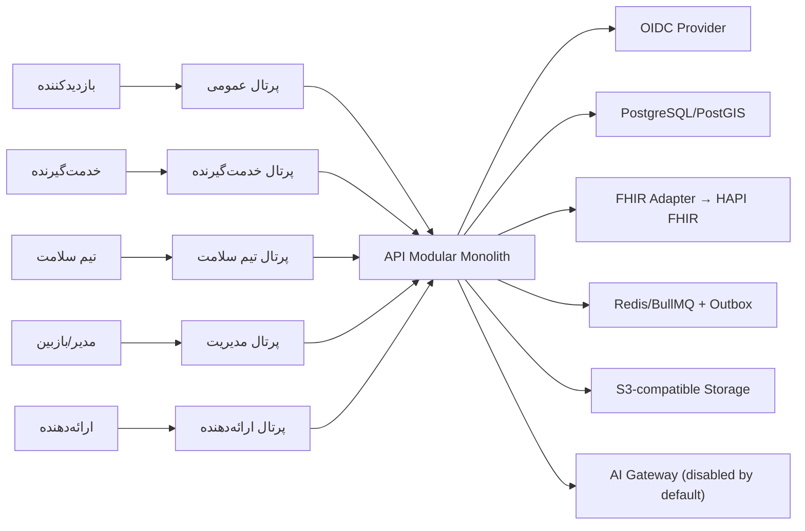

# System Context

```mermaid
flowchart LR
  A["بازدیدکننده"] --> P["پرتال عمومی"]
  M["خدمت‌گیرنده"] --> MW["پرتال خدمت‌گیرنده"]
  C["تیم سلامت"] --> CW["پرتال تیم سلامت"]
  D["مدیر/بازبین"] --> AW["پرتال مدیریت"]
  V["ارائه‌دهنده"] --> VW["پرتال ارائه‌دهنده"]
  P & MW & CW & AW & VW --> API["API Modular Monolith"]
  API --> IDP["OIDC Provider"]
  API --> DB["PostgreSQL/PostGIS"]
  API --> FHIR["FHIR Adapter → HAPI FHIR"]
  API --> BUS["Redis/BullMQ + Outbox"]
  API --> OBJ["S3-compatible Storage"]
  API --> AIG["AI Gateway (disabled by default)"]
```

Trust boundaries در threat model ثبت شده‌اند. هیچ UI به raw FHIR، دیتابیس یا provider خارجی مستقیم متصل نمی‌شود.
