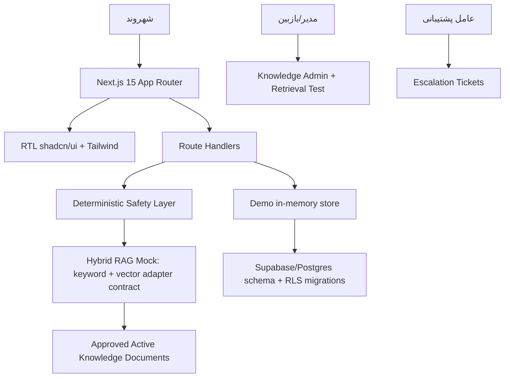
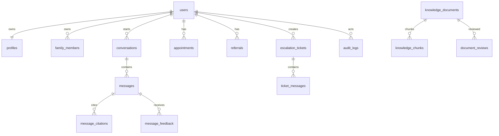

# دستیار پاسخ‌گوی پزشک خانواده

نسخه نمایشی production-oriented برای پلتفرم «همراه سلامت خانواده». برنامه RTL فارسی، موبایل‌اول، PWA، دارای داشبورد شهروند، دستیار RAG، safety layer، پنل مدیریت دانش، کنسول پشتیبانی، migrationهای Supabase و تست است.

## راه‌اندازی محلی

```bash
npm install
cp .env.example .env.local
npm run dev
```

آدرس محلی: `http://localhost:3000`

ورود demo: شماره پیش‌فرض صفحه ورود و OTP برابر `demo` یا `123456`.

## اسکریپت‌ها

```bash
npm run dev
npm run lint
npm run test
npm run build
npm run e2e
```

## مسیرهای اصلی

Public: `/`, `/about-family-physician`, `/faq`, `/emergency-guidance`, `/privacy`, `/terms`

Citizen: `/app`, `/app/assistant`, `/app/conversations`, `/app/doctor`, `/app/health-center`, `/app/appointments`, `/app/referrals`, `/app/reminders`, `/app/support`, `/app/profile`, `/app/family`

Admin: `/admin`, `/admin/documents`, `/admin/questions`, `/admin/analytics`, `/admin/settings`, `/admin/audit-logs`

Support: `/support-console`, `/support-console/tickets`

## معماری



## ERD خلاصه



## AI و RAG

`src/lib/ai.ts` یک adapter-agnostic LLM و embedding contract دارد. پیاده‌سازی فعلی mock است و از `src/lib/rag.ts` پاسخ ساختاریافته JSON تولید می‌کند. پاسخ‌های factual بدون منبع معتبر به پیام «اطلاعات کافی...» ختم می‌شوند.

Safety قبل از پاسخ اجرا می‌شود: prompt injection، استخراج system prompt، تشخیص/دوز/دارو، تفسیر آزمایش، self-harm و علائم فوری مسدود یا به هشدار فوری هدایت می‌شوند.

## Supabase

Migration در `supabase/migrations/0001_initial_schema.sql` شامل جدول‌های درخواستی، pgvector، full-text index، foreign key، soft delete، index و RLS پایه است. Seed در `supabase/seed.sql` داده demo فارسی و غیرقابل استناد را ایجاد می‌کند.

اجرای نمونه:

```bash
supabase start
supabase db reset
```

## امنیت و حریم خصوصی

- کلیدها فقط در env سرور قرار می‌گیرند و `.env.example` placeholder دارد.
- متن پیام قبل از logging ساده redaction می‌شود.
- analytics متن کامل حساس ذخیره نمی‌کند.
- خروجی مدل به HTML خام render نمی‌شود.
- document upload در MVP mock است، اما schema و admin flow برای MIME validation، review و approval آماده شده‌اند.
- RLS شهروند را به داده خودش محدود می‌کند و اسناد شهروند فقط approved + active قابل retrieval هستند.

## Integration Guide

آداپتورهای وزارت بهداشت در `src/lib/ministry-adapters.ts` تعریف شده‌اند:

- `CitizenIdentityAdapter`
- `PhysicianAssignmentAdapter`
- `HealthCenterAdapter`
- `AppointmentAdapter`
- `ReferralAdapter`
- `NotificationAdapter` در roadmap همین adapter pattern اضافه می‌شود.

برای production، mock را با clientهای lazy server-side جایگزین کنید، timeout/retry/audit-safe logging را حفظ کنید، و هیچ status ارجاع یا نوبتی را از مدل نسازید.

## محدودیت‌های فعلی

- AI provider واقعی وصل نشده و mock RAG استفاده می‌شود.
- Supabase client runtime هنوز جایگزین store نمایشی نشده است.
- document extraction واقعی PDF/DOCX و embedding خارجی به adapter production نیاز دارد.
- شماره‌های اورژانس hardcode نشده‌اند و باید در admin settings production مقداردهی شوند.
- Playwright ممکن است در اولین اجرا به نصب browser binaries نیاز داشته باشد.

